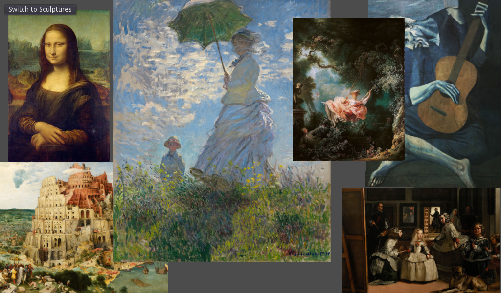

This is a demo showing how to use the `load_interactive()` method of
[`ResourceLoader`](https://docs.godotengine.org/en/latest/classes/class_resourceloader.html)
to load large scenes in the background with a progress bar.



```jsx
export default class BackgroundLoad extends godot.Control {
    constructor() {
        super();
        if (null == BackgroundLoad._inst) {
            BackgroundLoad._inst = this;
        }
    }
    static get singleton() {
        return this._inst;
    }
    load_scene(path) {
        this.worker.postMessage({ function: "load_resource", arguments: [path] });
    }
    _ready() {
        this.progress = this.get_node('CanvasLayer/Progress');
    }
    _enter_tree() {
        this.worker = new Worker("res://worker.js");
        this.worker.onmessage = this._onmessage.bind(this);
    }
    _exit_tree() {
        this.worker.terminate();
    }
    _onmessage(message) {
        switch (message.type) {
            case 'start':
                this.progress.visible = true;
                break;
            case 'progress':
                this.progress.max_value = message.total;
                this.progress.value = message.stage;
                break;
            case 'done':
                const tree = this.get_tree();
                this.progress.visible = false;
                let resource = godot.adopt_value(message.resource);
                let new_scene = resource.instance();
                tree.current_scene.free();
                tree.current_scene = null;
                tree.root.add_child(new_scene);
                tree.current_scene = new_scene;
                break;
            case 'error':
                this.progress.visible = false;
                break;
            default:
                break;
        }
    }
}
BackgroundLoad._inst = null;
```
